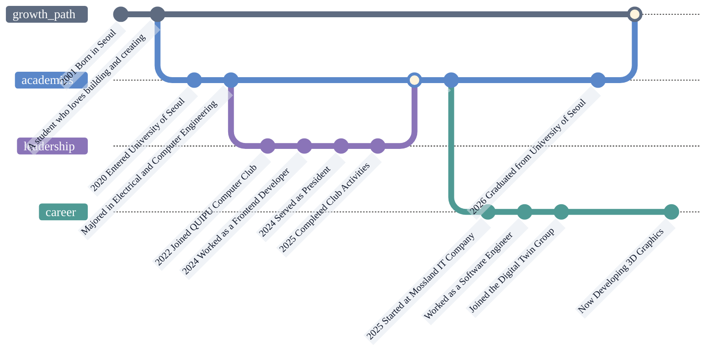

# YENA

   
  

I build digital twins that turn real-world complexity into clear 3D experiences.  
At Mossland, I create software that helps teams decide faster and operate smarter.

- **bio**  
  [https://yena.io.kr](https://yena.io.kr)
- **instagram**  
  [https://www.instagram.com/2ye.\_na](https://www.instagram.com/2ye._na)
- **email**  
  [yena@moss.land](mailto:yena@moss.land)

- **University of Seoul (2020-2025)** - B.S. in Electrical and Computer Engineering  
  [https://uos.ac.kr](https://uos.ac.kr)
- **QUIPU, University of Seoul Computer Club (2022-2025)** - Former President and Frontend Developer  
  [https://quipu.uos.ac.kr](https://quipu.uos.ac.kr)
- **Mossland (2025-Present)** - Software Engineer, Digital Twin Group  
  [https://moss.land](https://moss.land)

 

